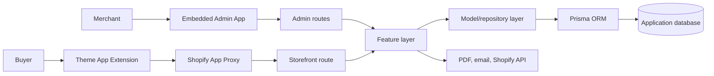
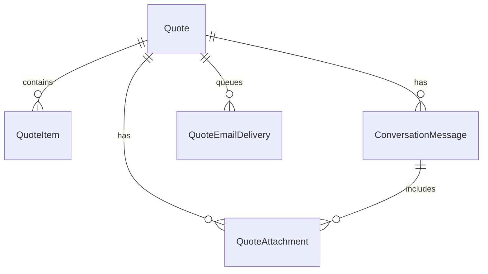

# Request a Quote — Project Structure & Architecture

## 1. Mục đích

Tài liệu này mô tả **cấu trúc source code và kiến trúc kỹ thuật hiện tại** của ứng dụng Request a Quote.

Nội dung tập trung vào:

- Các thành phần của hệ thống.
- Trách nhiệm của từng thư mục/layer.
- Quy tắc dependency giữa các layer.
- Vị trí code của từng domain chính.
- Luồng request và dữ liệu ở mức kiến trúc.

Danh sách tính năng và use case chi tiết được tách riêng tại [rfq-use-cases-and-features.md](./rfq-use-cases-and-features.md).

## 2. Tổng quan hệ thống

Project gồm ba phần chính:

1. **Merchant Admin App**: React Router app được nhúng trong Shopify Admin.
2. **Buyer Storefront Widget**: Theme App Extension chạy trên storefront của merchant.
3. **Application Backend**: xác thực request, xử lý nghiệp vụ, truy cập database, gọi Shopify Admin API, tạo PDF và gửi email.



## 3. Công nghệ chính

| Thành phần | Công nghệ |
|---|---|
| Application framework | React Router 7, React 18, TypeScript |
| Shopify integration | Shopify App Bridge, Shopify CLI, Shopify App Proxy |
| Storefront | Theme App Extension, Liquid, JavaScript, CSS |
| Database access | Prisma ORM |
| Database development | SQLite |
| PDF generation | `pdf-lib` |
| Email hiện tại | Email outbox và SendGrid HTTP API |
| Testing | Vitest |
| Code quality | ESLint, TypeScript |

## 4. Cây thư mục cấp cao

```text
app-test/
├── app/                          # Admin frontend và application backend
│   ├── components/               # React UI theo module
│   ├── features/                 # Nghiệp vụ/use case theo domain
│   ├── lib/                      # Logic dùng chung, không thuộc riêng domain
│   ├── models/                   # Repository và truy cập dữ liệu
│   ├── routes/                   # React Router endpoints
│   ├── styles/                   # CSS Modules của Admin App
│   ├── tests/                    # Route/integration tests
│   ├── db.server.ts              # Prisma client
│   ├── shopify.server.ts         # Shopify authentication/configuration
│   └── root.tsx                  # React Router root
├── extensions/
│   └── request-a-quote/          # Buyer Theme App Extension
├── prisma/
│   ├── migrations/               # Lịch sử migration
│   ├── schema.prisma             # Database schema
│   └── dev.sqlite                # Local development database
├── scripts/                      # Build/setup scripts
├── docs/                         # Architecture, use case và báo cáo
├── shopify.app.toml              # Shopify app configuration
├── package.json                  # Scripts và dependencies
└── vite.config.ts                # Vite/React Router build config
```

## 5. Kiến trúc trong thư mục `app`

Luồng dependency chuẩn:

```text
Route → Feature → Model/Repository → Prisma → Database
  │         │
  │         └────────→ External services
  └──→ Component → Style
```

Dependency chỉ đi từ layer bên ngoài vào layer bên trong. Model không được import route hoặc component.

### 5.1. `app/routes` — HTTP và route orchestration

Route chịu trách nhiệm:

- Xác thực request.
- Đọc params, query và form data.
- Gọi feature service phù hợp.
- Trả response hoặc render page.

Route không nên chứa UI lớn, Prisma query hoặc business logic dài.

Các nhóm route hiện tại:

```text
app/routes/
├── app.tsx                               # Layout và auth của Admin App
├── app._index.tsx                        # Admin dashboard
├── app.quotes.tsx                        # Quote list
├── app.quotes_.$quoteId.tsx              # Quote detail
├── app.quotes_.$quoteId.messages.tsx     # Merchant chat endpoint
├── app.quotes_.$quoteId.pdf.tsx          # Merchant PDF download
├── app.settings.tsx                      # Quote settings
├── app.widget.tsx                        # Widget settings
├── app.email.tsx                         # Email template settings
├── app.pdf.tsx                           # PDF template settings
├── api.storefront.$.tsx                  # Buyer/App Proxy API gateway
├── api.jobs.quotes.expiration.tsx        # Scheduled job endpoint
└── webhooks.*.tsx                        # Shopify webhooks
```

### 5.2. `app/components` — Admin React UI

Component được nhóm theo màn hình/domain:

```text
app/components/
├── quotes/           # Quote list, detail, items, chat, dialogs
├── settings/         # Eligibility và expiration settings
├── widget/           # Widget editor và preview panels
├── email-template/   # Email branding/editor preview
└── pdf-template/     # PDF editor và preview
```

Component chỉ xử lý presentation và UI state. Component không truy cập Prisma hoặc gọi provider trực tiếp.

### 5.3. `app/features` — Nghiệp vụ theo domain

Đây là layer chính chứa use case, validation, orchestration và service theo domain.

```text
app/features/
├── quotes/
│   ├── conversation/             # Upload attachment của chat
│   ├── quote-list-*               # Quote list loader/action/client logic
│   ├── quote-detail-*             # Detail loader và các action nhỏ
│   ├── quote-edit-policy.ts       # Quyền chỉnh sửa quote
│   └── quote-conversation.ts      # Shared conversation types/helpers
├── storefront/
│   ├── storefront-api.server.ts   # Điều phối Buyer API
│   ├── storefront-loader.server.ts
│   ├── storefront-create-quote.server.ts
│   ├── storefront-messages.server.ts
│   ├── storefront-status.server.ts
│   └── storefront-quote-read.server.ts
├── email/
│   ├── delivery/                  # Factory, SMTP, SES, SendGrid và outbox
│   ├── rendering/                 # Email context và HTML renderer
│   ├── preview/                   # Email preview service
│   ├── portal/                    # Buyer portal token
│   └── quote-email.server.ts      # Email facade/orchestration
├── pdf/
│   ├── quote-pdf.server.ts        # PDF generator
│   ├── quote-pdf-download.server.ts
│   └── quote-pdf-format.ts
├── email-template/                # Load/save/preview email template
├── pdf-template/                  # Load/save PDF template
├── settings/                      # Settings validation và hooks
└── widget/                        # Widget settings và Admin service
```

### 5.4. `app/models` — Persistence và repository

```text
app/models/
├── quote.server.ts                    # Public quote repository facade
├── quote-query.server.ts              # Quote read queries
├── quote-create.server.ts             # Create persistence flow
├── quote-mutation.server.ts           # Quote mutations
├── quote-message.server.ts            # Message persistence
├── quote-expiration.server.ts         # Expiration persistence/job logic
├── quote-setting.server.ts            # General/widget settings repository
├── quote-pdf-setting.server.ts        # PDF setting repository
├── quote-email-branding.server.ts     # Email branding repository
└── privacy.server.ts                  # Privacy request persistence
```

Các file `*.types.ts`, `*.shared.ts` và `*.config.shared.ts` trong models hiện cung cấp type/config dùng chung cho repository và feature liên quan.

### 5.5. `app/lib` — Shared domain-independent logic

```text
app/lib/
├── contact-validation.ts          # Chuẩn hóa/validate contact
├── quote-message-policy.ts        # Chính sách message dùng ở nhiều entry point
├── quote-status.ts                # Trạng thái và transition của quote
└── request-identity.server.ts      # Request identity helper
```

Không đặt PDF, email hoặc widget service trong `lib` vì các service đó đã có domain tương ứng trong `features`.

### 5.6. `app/styles`

```text
app/styles/
├── shared.module.css
├── quote-list.module.css
├── quote-detail.module.css
├── settings.module.css
├── widget-admin.module.css
├── email.module.css
└── pdf.module.css
```

## 6. Buyer Theme App Extension

```text
extensions/request-a-quote/
├── blocks/
│   ├── add-to-quote.liquid        # Product page block
│   └── quote-app-embed.liquid     # Global widget/app embed
├── src/
│   ├── widget/                    # Widget source fragments
│   │   ├── core.js
│   │   ├── cart-and-customer.js
│   │   ├── history.js
│   │   └── quote-detail-and-chat.js
│   └── styles/                    # Widget source CSS
│       ├── base.css
│       ├── cart.css
│       ├── history.css
│       └── responsive.css
├── assets/
│   ├── quote-widget.js            # Generated bundle
│   ├── quote-widget.css           # Generated CSS
│   └── quote-locale-*.json        # Buyer translations
├── locales/                       # Theme editor translations
└── shopify.extension.toml
```

`scripts/build-widget.mjs` ghép các source fragment theo đúng thứ tự thành asset Shopify sử dụng. Không sửa trực tiếp `assets/quote-widget.js` hoặc `assets/quote-widget.css`; phải sửa file trong `src` rồi chạy:

```bash
npm run build:widget
```

## 7. Database và multi-tenancy

`prisma/schema.prisma` là nguồn chính thức của database schema.

Các entity chính:


## Database và multi-tenancy

Ứng dụng sử dụng chung một database cho nhiều Shopify shop. Trường `shop` là tenant key, vì vậy mọi truy vấn dữ liệu merchant phải được giới hạn theo shop đã xác thực. Buyer chỉ được đọc hoặc thay đổi quote sau khi backend kiểm tra quyền sở hữu.

Local development hiện sử dụng SQLite. Production database và kế hoạch migration sẽ được xác định riêng trước khi triển khai production.

SQLite hiện dùng cho local development. Việc chuyển sang PostgreSQL cho production là một migration riêng, không thuộc cấu trúc code hiện tại.

## 8. Các luồng kỹ thuật chính

### 8.1. Merchant Admin

```text
Shopify Admin
  → app.* route
  → authenticate.admin(request)
  → feature loader/action
  → model/repository
  → Prisma hoặc Shopify Admin API
```

### 8.2. Buyer Storefront

```text
Theme App Extension
  → Shopify App Proxy
  → api.storefront.$.tsx
  → storefront feature handler
  → customer/guest authorization
  → quote model
  → database
```

### 8.3. Email delivery

```text
Quote event
  → quote-email facade
  → QuoteEmailDelivery outbox
  → email worker
  → EmailProvider factory
  → SMTP/MailHog, AWS SES hoặc SendGrid
```

### 8.4. PDF download

```text
Merchant route hoặc Buyer storefront handler
  → authorization
  → quote-pdf-download service
  → quote + branding + PDF settings
  → quote-pdf generator
  → application/pdf response
```

## 9. Authentication boundaries

| Entry point | Cơ chế | Quyền truy cập |
|---|---|---|
| Merchant routes | `authenticate.admin(request)` | Chỉ dữ liệu thuộc shop trong session |
| Storefront API | Shopify App Proxy authentication | Shop tương ứng với proxy request |
| Buyer quote action | Customer/guest authorization | Chỉ quote thuộc buyer |
| Scheduled job | Secret header/scheduler identity | Job expiration, reminder và email queue |
| Shopify webhook | Shopify webhook authentication | Topic và shop đã xác thực |

## 10. Quy tắc bắt buộc khi thêm hoặc tách code

1. Route chỉ xác thực, parse input và điều phối.
2. UI được chia theo component, không truy cập database.
3. Business logic thuộc domain nào phải nằm trong `features/<domain>`.
4. Prisma query và persistence nằm trong `models`.
5. Chỉ đưa code vào `lib` khi nó thực sự dùng chung và không thuộc một domain cụ thể.
6. Không duplicate logic giữa Merchant và Buyer; hai entry point phải gọi chung feature/model phù hợp.
7. External provider phải nằm sau service hoặc interface.
8. Mọi query tenant data phải có điều kiện `shop`.
9. Mọi buyer action phải kiểm tra ownership.
10. Schema thay đổi phải kèm migration.
11. File mới phải có tên thể hiện trách nhiệm; tránh các file chung chung như `utils.ts` hoặc `helpers.ts`.
12. Sau refactor phải chạy lint, typecheck, test và production build.

## 11. Lệnh kiểm tra

```bash
npm run build:widget
npm run lint
npm run typecheck
npm test
npm run build
```

## 12. Phạm vi của các tài liệu

| Tài liệu | Nội dung |
|---|---|
| `project-architecture.md` | Cấu trúc source, layer, dependency và luồng kỹ thuật |
| `rfq-use-cases-and-features.md` | Actor, use case, feature và flow nghiệp vụ |
| `email-delivery.md` | MailHog local, provider config và AWS SES production |
| `weekly-reports/` | Tiến độ, cập nhật và khó khăn theo tuần |
