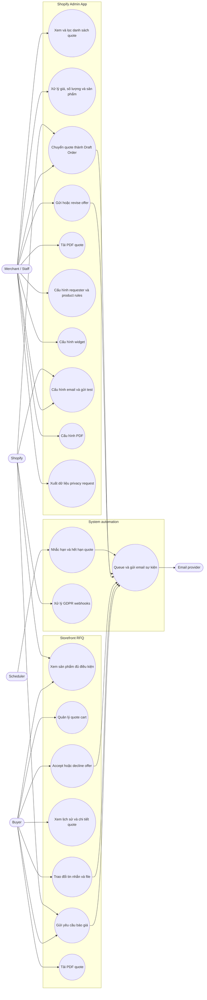
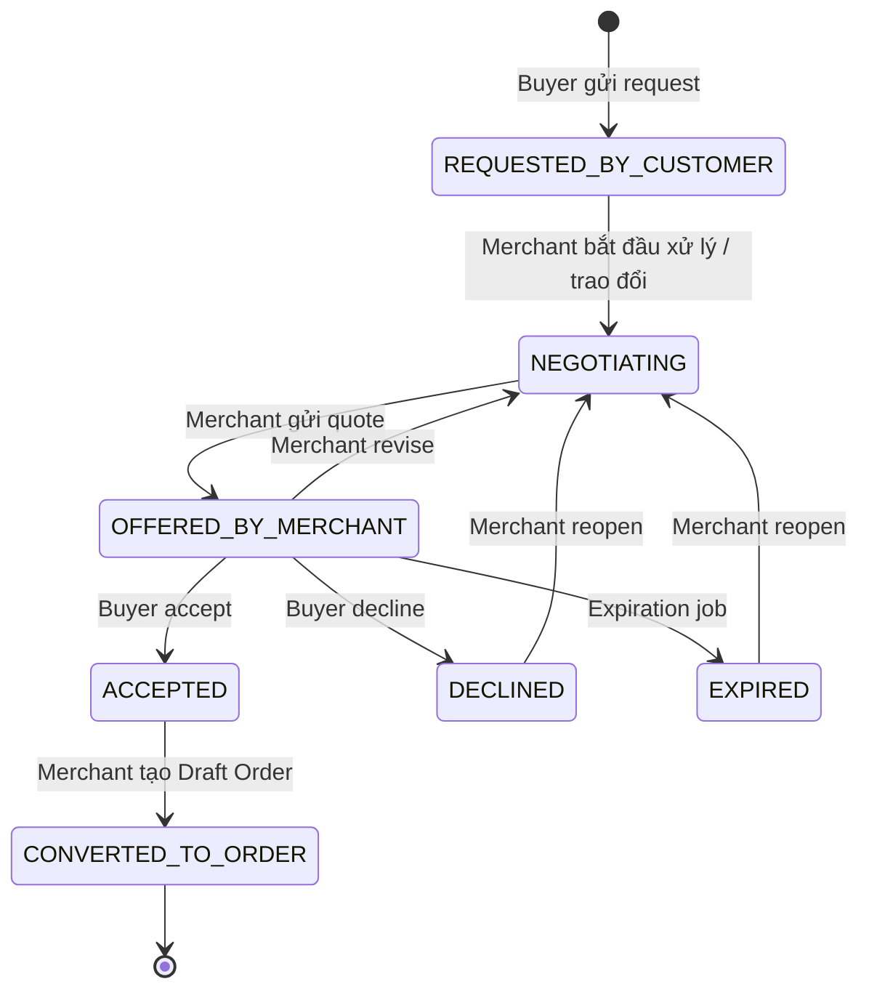
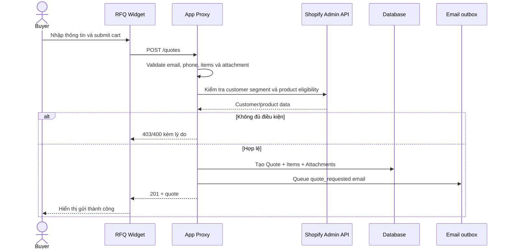
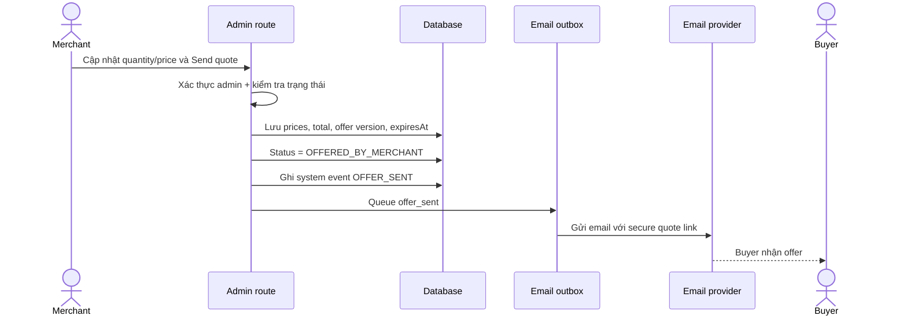
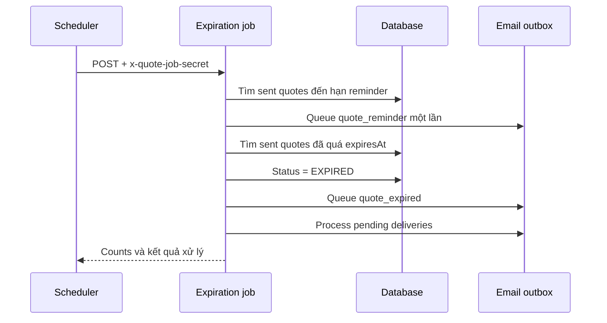
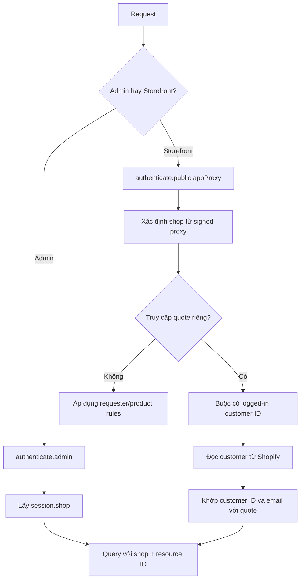
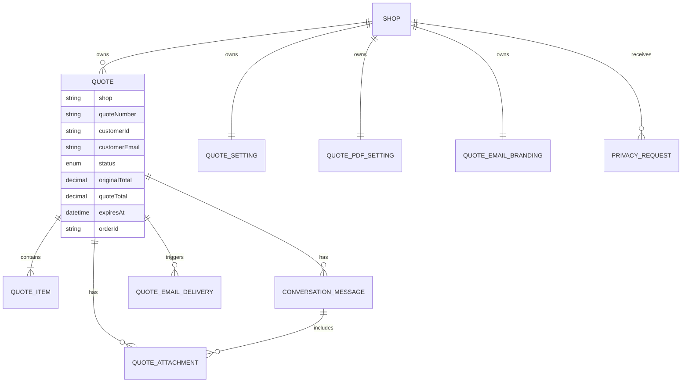

# Request a Quote — Use cases và mô tả tính năng

## 1. Tổng quan hệ thống

Request a Quote (RFQ) là Shopify embedded app cho phép buyer gửi danh sách sản phẩm cần báo giá, trao đổi với merchant, nhận mức giá đề xuất, chấp nhận hoặc từ chối báo giá. Merchant quản lý toàn bộ quote trong Shopify Admin và có thể chuyển quote đã được buyer chấp nhận thành Shopify Draft Order.

Hệ thống gồm ba phần:

- **Storefront:** Theme App Extension hiển thị widget RFQ, quote cart, form yêu cầu, lịch sử và chi tiết quote.
- **Merchant Admin:** Embedded app quản lý quote, cấu hình quyền gửi quote, sản phẩm, widget, email, PDF và yêu cầu quyền riêng tư.
- **Backend:** React Router routes, Shopify App Proxy, Prisma, Shopify Admin GraphQL, hàng đợi email và scheduled expiration job.

## 2. Actors

| Actor | Vai trò |
| --- | --- |
| Buyer / Customer | Tạo và theo dõi yêu cầu báo giá trên storefront. Phải đăng nhập đúng Shopify customer account để xem chi tiết, gửi tin nhắn, phản hồi và tải PDF. |
| Merchant / Staff | Sử dụng embedded app trong Shopify Admin để xử lý quote và cấu hình app. |
| Shopify | Xác thực Admin/App Proxy, cung cấp customer, product, collection, file và Draft Order APIs; gửi webhook. |
| Email provider | Gửi email được tạo từ email outbox; hiện tại tích hợp theo cấu hình SendGrid. |
| Scheduler | Gọi expiration job bằng `POST` và secret header để gửi reminder hoặc đánh dấu quote hết hạn. |
| Privacy processor | Nhận Shopify compliance webhooks và xuất/xóa dữ liệu theo customer hoặc shop. |

## 3. Sơ đồ use case tổng thể

## 4. Quote lifecycle

### 4.1 State diagram

### 4.2 Quy tắc trạng thái

| Trạng thái | Ý nghĩa | Hành động tiếp theo hợp lệ |
| --- | --- | --- |
| `REQUESTED_BY_CUSTOMER` | Buyer vừa gửi yêu cầu | Bắt đầu thương lượng, sửa dữ liệu và gửi offer |
| `NEGOTIATING` | Merchant và buyer đang trao đổi | Sửa sản phẩm, quantity, quote price; gửi offer |
| `OFFERED_BY_MERCHANT` | Offer đã gửi và đang chờ buyer | Buyer accept/decline; merchant revise; scheduler có thể expire |
| `ACCEPTED` | Buyer đã chấp nhận | Merchant chuyển thành Draft Order |
| `DECLINED` | Buyer đã từ chối | Merchant có thể reopen để thương lượng lại |
| `EXPIRED` | Offer hết hạn | Không còn accept được; merchant có thể reopen |
| `CONVERTED_TO_ORDER` | Đã tạo Shopify Draft Order | Trạng thái cuối, quote bị khóa chỉnh sửa |

`Due date` chỉ xuất hiện khi quote đã được gửi (`OFFERED_BY_MERCHANT`) hoặc đã hết hạn (`EXPIRED`) và có `expiresAt`.

## 5. Use cases phía buyer

### UC-B01 — Xem nút và sản phẩm đủ điều kiện RFQ

**Tiền điều kiện:** Theme App Extension/app embed đã được bật.

**Flow chính:**

1. Widget tải settings từ Shopify App Proxy.
2. Backend kiểm tra rule requester và product eligibility của shop.
3. Với product rule `ALL`, tất cả sản phẩm hợp lệ.
4. Với `SELECTED` hoặc `EXCLUDED`, backend đối chiếu product/collection được cấu hình.
5. Widget chỉ cho buyer thêm sản phẩm hợp lệ vào quote cart.

Backend kiểm tra lại eligibility khi submit; buyer không thể bỏ qua rule chỉ bằng cách sửa JavaScript phía trình duyệt.

### UC-B02 — Quản lý quote cart

Buyer có thể:

- Thêm sản phẩm/variant vào quote cart.
- Thay đổi quantity hoặc xóa item.
- Tìm thêm sản phẩm hợp lệ từ catalog.
- Nhập ghi chú và chọn file đính kèm.
- Tiếp tục giữ cart ở storefront trong quá trình thao tác.

### UC-B03 — Gửi yêu cầu báo giá

**Dữ liệu được lưu:** customer identity/contact/address, currency, note, sản phẩm, variant, ảnh, quantity, giá gốc, quote price ban đầu, inventory status và attachments.

**Requester rules hỗ trợ:**

- Cho phép tất cả requester.
- Chọn customer cụ thể.
- Match theo email pattern.
- Customer chưa từng mua.
- Repeat customer.
- Customer có abandoned checkout.
- Email subscriber.
- Customer đã mua hàng.

### UC-B04 — Xem lịch sử và chi tiết quote

- Lịch sử được tải theo Shopify customer ID/email trong phạm vi shop.
- Có tìm kiếm/lọc trạng thái trong widget.
- Chi tiết hiển thị thông tin offer, items, totals, conversation và attachments.
- Khi mở quote, backend xác minh customer đang đăng nhập có đúng ID và email thuộc quote hay không.
- Customer khác nhận `403`; khách chưa đăng nhập nhận `401`.
- Hệ thống lưu read state để tính tin nhắn chưa đọc.

### UC-B05 — Trao đổi với merchant

- Gửi text hoặc chỉ gửi attachments.
- Hỗ trợ PNG, PDF, JPG/JPEG, DOC/DOCX theo policy hiện tại.
- Validate metadata, kích thước và giới hạn message ở backend.
- Có idempotency bằng `clientMessageId` để hạn chế tạo trùng khi retry.
- Có rate/identity protection dựa trên customer actor và request IP hash.
- UI dùng optimistic message rồi đồng bộ lại với dữ liệu backend.

### UC-B06 — Accept hoặc decline offer

Buyer chỉ có thể phản hồi khi quote ở `OFFERED_BY_MERCHANT`:

- **Accept:** chuyển sang `ACCEPTED` và queue email xác nhận.
- **Decline:** chuyển sang `DECLINED` và queue email xác nhận.
- Quote `EXPIRED` không thể accept.
- Backend xác thực ownership và state transition trước khi cập nhật.

### UC-B07 — Tải PDF

- Buyer tải PDF thật qua App Proxy, không dùng admin route.
- Backend xác thực customer ID/email hoặc portal token hợp lệ.
- PDF dùng cùng settings, logo và branding của shop.
- PDF hỗ trợ nhiều trang A4, ảnh sản phẩm, quantity, giá, tổng, footer và page number.

## 6. Use cases phía merchant

### UC-M01 — Dashboard và danh sách quote

Merchant đăng nhập Shopify Admin và có thể:

- Xem dashboard tổng quan quote.
- Xem danh sách được phân trang.
- Tìm kiếm, filter theo trạng thái và sort.
- Xem unread indicator.
- Mở chế độ view, edit hoặc conversation.
- Export danh sách quote ra CSV.
- Xóa một hoặc nhiều quote.
- Reopen quote đã decline/expire hoặc revise offer đã gửi.

Mọi loader/action admin đều đi qua `authenticate.admin()` và query theo `session.shop`.

### UC-M02 — Xử lý quote detail

Merchant có thể:

- Xem thông tin buyer, địa chỉ, ghi chú và attachments.
- Tìm và thêm Shopify products vào quote.
- Thay đổi quantity và quote price.
- Lưu giá tạm khi quote còn editable.
- Xem original total và quote total.
- Gửi tin nhắn/file cho buyer.
- Tải PDF của quote.

Khi quote đã sent, accepted, declined, expired, converted hoặc có order ID, giá và sản phẩm bị khóa. Muốn sửa offer đã gửi, merchant phải chọn **Revise quote**, đưa quote về `NEGOTIATING`.

### UC-M03 — Gửi offer

`expiresAt` được tính khi gửi offer dựa trên số ngày hết hạn trong Settings. Mỗi lần gửi offer mới, `offerVersion` hỗ trợ idempotency của email event.

### UC-M04 — Reopen hoặc revise

- `OFFERED_BY_MERCHANT → NEGOTIATING`: revise offer.
- `DECLINED → NEGOTIATING`: reopen quote.
- `EXPIRED → NEGOTIATING`: reopen quote.
- Hệ thống xóa/điều chỉnh dữ liệu expiration phù hợp và ghi system message vào conversation.

### UC-M05 — Convert thành Shopify Draft Order

**Tiền điều kiện:** quote ở `ACCEPTED` và chưa có `orderId`.

1. Merchant chọn **Convert quote**.
2. Backend gọi Shopify `draftOrderCreate`.
3. Line items dùng title, quantity và mức `quotePrice` đã được chấp nhận.
4. Draft Order được gắn tag `RFQ`, quote number và custom attribute Quote ID.
5. App lưu `orderId`, `orderName`, `orderInvoiceUrl`.
6. Quote chuyển thành `CONVERTED_TO_ORDER` và queue email `quote_converted`.

### UC-M06 — Cấu hình requester và product eligibility

Trang Settings gồm:

- Requester scope và customer segments.
- Customer cụ thể và email patterns.
- Product eligibility: tất cả, chỉ selected, hoặc loại trừ selected.
- Chọn Shopify product/collection làm resource rule.
- Số ngày quote hết hạn.
- Số ngày gửi reminder trước khi hết hạn; nhập `0` để tắt reminder.

### UC-M07 — Cấu hình widget

- Kiểu circle + icon hoặc rectangle + text.
- Button text, size và orientation.
- Animation.
- Vị trí riêng cho desktop/mobile.
- Display mode và specific pages.
- Background/text colors.
- Upload icon tùy chỉnh có validate loại file và tối đa 1 MB.
- Preview trực tiếp trước khi save.

### UC-M08 — Cấu hình email

Các event template hiện có:

| Key | Sự kiện |
| --- | --- |
| `quote_requested` | Buyer gửi request |
| `negotiation_started` | Merchant bắt đầu phản hồi/thương lượng |
| `offer_sent` | Merchant gửi offer |
| `quote_accepted` | Buyer accept |
| `quote_declined` | Buyer decline |
| `quote_reminder` | Quote gần hết hạn |
| `quote_expired` | Quote hết hạn |
| `quote_converted` | Quote được chuyển thành Draft Order |

Merchant hiện cấu hình **theme và branding**, không chỉnh nội dung tự do:

- Chọn email theme.
- Logo ưu tiên Shopify Brand; có fallback logo upload vào Shopify Files.
- Sender name, primary/link color, signature, reply-to và footer.
- Preview theo event và dữ liệu quote gần nhất.
- Gửi test email.
- Reset về Clean theme.
- Dev có thao tác process queue thủ công; production vô hiệu hóa thao tác này.

### UC-M09 — Cấu hình PDF

- Bật/tắt quote date và due date.
- Chọn date format.
- Bật/tắt original price, quote price, total và product image.
- Logo lấy từ email branding.
- Điều chỉnh logo size, font, font size và colors.
- Preview dùng quote gần nhất thay vì dữ liệu demo hard-code.
- Merchant và buyer tải PDF từ hai endpoint được phân quyền riêng nhưng dùng cùng generator/settings.

### UC-M10 — Privacy requests

- Trang Privacy Requests liệt kê customer data exports được tạo bởi compliance webhook.
- Merchant có thể tải JSON export.
- Customer redact xóa quote và dữ liệu liên quan của đúng customer.
- Shop redact hoặc app uninstall xóa toàn bộ dữ liệu app thuộc shop.

## 7. Use cases tự động của hệ thống

### UC-S01 — Email outbox

Email không phụ thuộc trực tiếp vào request UI. Event tạo một `QuoteEmailDelivery` ở trạng thái `PENDING` với idempotency key. Processor gửi email, lưu provider message ID, số lần thử, lỗi, thời điểm retry và thời điểm gửi thành công.

### UC-S02 — Reminder và expiration

Public job endpoint:

- Chỉ chấp nhận `POST`.
- Secret chỉ nhận từ `x-quote-job-secret`, không nhận query string.
- So sánh secret bằng timing-safe comparison.

### UC-S03 — Shopify compliance và uninstall

| Topic | Xử lý |
| --- | --- |
| `customers/data_request` | Tạo JSON export gồm quote, items, messages, attachments và email deliveries của customer. |
| `customers/redact` | Xóa dữ liệu RFQ thuộc customer trong shop. |
| `shop/redact` | Xóa toàn bộ dữ liệu app thuộc shop. |
| `app/uninstalled` | Xóa dữ liệu app và sessions của shop. |

## 8. Authorization và data isolation

Nguyên tắc bắt buộc:

- Merchant chỉ thao tác dữ liệu của `session.shop`.
- Buyer phải đăng nhập đúng customer account sở hữu quote.
- Portal token nếu được cung cấp phải hợp lệ, nhưng ownership vẫn được kiểm tra.
- Download PDF buyer không dùng admin route.
- Status transition được validate ở backend, không tin trạng thái từ UI.

## 9. Route map chính

| Khu vực | Route | Mục đích |
| --- | --- | --- |
| Admin | `/app` | Dashboard |
| Admin | `/app/quotes` | Danh sách, filter, sort, bulk actions, CSV |
| Admin | `/app/quotes/:quoteId` | Quote detail và xử lý nghiệp vụ |
| Admin | `/app/quotes/:quoteId/pdf` | Merchant PDF download |
| Admin | `/app/settings` | Requester, product và expiration settings |
| Admin | `/app/widget` | Widget customization |
| Admin | `/app/email` | Email theme/branding/preview/test |
| Admin | `/app/pdf` | PDF editor và preview |
| Admin | `/app/privacy` | Customer data exports |
| Storefront | `/apps/request-a-quote/*` | Shopify App Proxy cho settings, quotes, messages, status và buyer PDF |
| Job | `/api/jobs/quotes/expiration` | Secured scheduled expiration/email processing |
| Webhook | `/webhooks/compliance` | GDPR compliance topics |
| Webhook | `/webhooks/app/uninstalled` | Cleanup khi uninstall |

## 10. Dữ liệu nghiệp vụ chính

## 11. Giới hạn và lưu ý triển khai hiện tại

- Database hiện vẫn là SQLite cho development; trước production multi-instance cần migration riêng sang PostgreSQL.
- Production phải thay localhost trong `shopify.app.toml` bằng HTTPS production domain.
- Email delivery cần SendGrid/environment configuration và scheduler chạy định kỳ.
- Theme App Extension/app embed phải được merchant bật để widget xuất hiện trên storefront.
- Customer data access phụ thuộc Shopify protected customer data permissions của app.
- Tất cả thay đổi schema phải đi qua Prisma migrations, không tạo bảng/cột khi request đang chạy.

## 12. Feature matrix

| Feature | Buyer | Merchant | System |
| --- | :---: | :---: | :---: |
| Product eligibility | Xem/kích hoạt theo rule | Cấu hình | Enforce backend |
| Quote cart/request | Có | Xem kết quả | Validate và lưu |
| Quote pricing | Xem offer | Sửa và gửi | Tính total/version |
| Conversation/files | Gửi/nhận | Gửi/nhận | Validate/idempotency |
| Accept/decline | Có | Xem trạng thái | Validate transition/email |
| Reopen/revise | Không | Có | Ghi system event |
| Draft Order | Xem kết quả | Convert | Shopify GraphQL |
| PDF | Tải có authorization | Preview/cấu hình/tải | Multi-page generator |
| Email | Nhận | Branding/preview/test | Queue/retry/send |
| Expiration | Xem due date/state | Cấu hình/reopen | Reminder/expire job |
| Privacy | Dữ liệu được bảo vệ | Tải export | Export/redact/cleanup |

